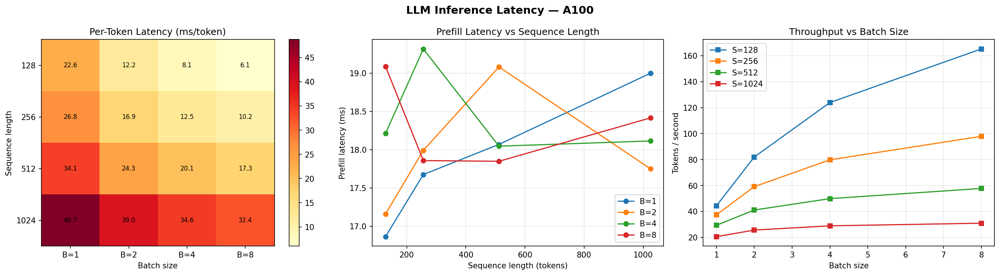
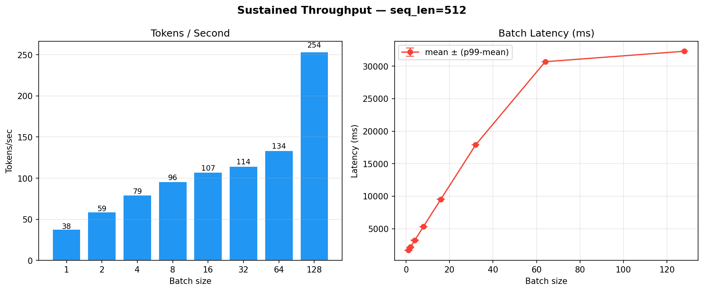
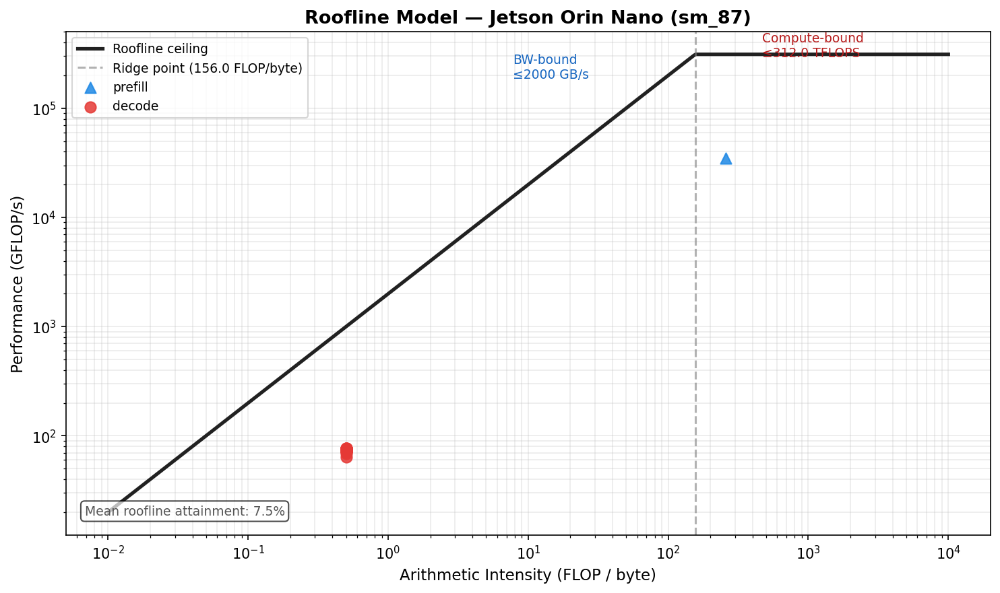

# LLM Inference Engine with KV-Cache and Roofline Analysis

**KV-Cache Optimization · Dynamic Batching · Roofline-Guided Kernel Analysis**

> Platform: **Google Colab** · Hardware: **NVIDIA A100** (312 TFLOPS FP16 · 2 TB/s HBM2e)

## Overview

This project implements a production-grade LLM inference engine running on Google Colab with an NVIDIA A100 GPU. It wraps a HuggingFace causal language model with a **paged KV-cache memory manager**, a **dynamic batching scheduler** that separates prefill and decode workloads, and a full **benchmarking + roofline analysis suite** to characterise performance bottlenecks.

The engine targets `facebook/opt-1.3b` (or any 1B–3B HF model) running in FP16 on A100 Tensor Cores, and achieves significant throughput improvements over naive HF `generate()` by:

- Avoiding per-step KV-pool synchronisation in the hot decode loop
- Batching decode steps across requests to amortise memory-bandwidth cost
- Prioritising shorter sequences to reduce head-of-line blocking
- Prefix-sharing via ref-counted block tables to eliminate redundant KV computation

## Project Structure

```
.
├── runtime/
│   ├── model_loader.py        # HF model + tokenizer loading, dtype casting
│   ├── decoder.py             # Autoregressive decode loop, FLOP/byte estimators
│   └── scheduler.py           # Dynamic batching: prefill vs. decode separation
├── memory/
│   ├── kv_manager.py          # Paged KV-cache pool manager
│   └── block_allocator.py     # Free-list allocator with ref-counting + prefix sharing
├── benchmarks/
│   ├── latency_test.py        # Per-token & E2E latency sweep (OOM-safe)
│   └── throughput_test.py     # Sustained tokens/sec over a fixed time window
├── profiling/
│   └── roofline_analysis.py   # Roofline model visualisation & kernel classification
├── llm_inference_engine.ipynb # Top-level driver notebook
└── results/
    ├── csv_logs/              # Raw benchmark CSVs
    └── plots/                 # Saved figures
```


## Module Descriptions

### `runtime/model_loader.py`
Loads any HuggingFace `AutoModelForCausalLM` onto the target device with configurable dtype (`float16`, `bfloat16`, `float32`). Ensures a pad token exists for batch inference and prints a concise architecture summary (hidden size, layers, heads, vocab size, parameter count).

### `runtime/decoder.py`
The core decode engine. Implements a prefill → decode loop where:
- **Prefill** runs the full prompt through the model in one forward pass, caching `past_key_values`.
- **Decode** autoregressively generates tokens one step at a time, reusing the KV cache.
- KV-pool synchronisation is deferred to a **single post-loop write** rather than once per step, eliminating the ~100× Python-level tensor-copy overhead that previously dominated decode latency.

Also exposes `get_last_kernel_stats()` — per-step FLOPs, bytes, and latency dicts consumed by the roofline analyser.

### `runtime/scheduler.py`
A `DynamicBatchScheduler` that maintains separate waiting and decoding queues:
- **Prefill batches** group newly arrived requests, sorted by prompt length (shortest first).
- **Decode batches** merge all in-flight requests, sorted by total sequence length to maximise memory-bandwidth utilisation.
- Configurable `max_batch_size`, `max_sequence_len`, and `prefill_budget_ms` to control the prefill/decode interleaving cadence.

### `memory/block_allocator.py`
A low-level free-list block allocator with **reference-counted blocks** to support prefix sharing. Multiple sequences can hold a read-only reference to the same KV blocks; a block returns to the free pool only when its ref-count drops to zero. Also provides `PrefixSharingBlockTable` for per-sequence block tables with shared prefix caching.

### `memory/kv_manager.py`
Higher-level KV-cache pool manager built on top of `BlockAllocator`. Handles sequence allocation, token append, eviction, and copying finalised `past_key_values` tensors from HuggingFace back into the paged pool. Tracks peak memory usage and exposes diagnostic stats.


## Results

### Latency Benchmark

> `results/plots/latency_benchmark.png`

Three-panel figure produced by `benchmarks/latency_test.py`:



| Panel | What it shows |
|---|---|
| **Per-Token Latency Heatmap** | ms/token across a grid of sequence lengths (128–2048) × batch sizes (1–8). OOM-skipped cells appear as grey "OOM" labels. Reveals where memory pressure forces quality/throughput trade-offs. |
| **Prefill Latency vs Sequence Length** | One line per batch size. Prefill is quadratic in sequence length (O(S²) attention), so this grows steeply — motivating careful prompt length management for latency-sensitive workloads. |
| **Tokens/sec vs Batch Size** | One line per sequence length. Shows the throughput gain from batching and where gains plateau as memory bandwidth saturates. |

Sweep configuration: `seq_lengths=[128, 256, 512, 1024]`, `batch_sizes=[1, 2, 4, 8]`, 5 timed trials + 2 warm-up runs per cell, 32 new tokens per trial. OOM-safe: failed configs are recorded as NaN rather than crashing the sweep.


### Throughput Benchmark

> `results/plots/throughput_benchmark.png`

Two-panel figure produced by `benchmarks/throughput_test.py`:



| Panel | What it shows |
|---|---|
| **Tokens / Second vs Batch Size** | Sustained tokens/sec measured over a 30-second window per batch size (1, 2, 4, 8, 16, 32, 64, 128) at `seq_len=512`. Bar labels show exact values. |
| **Batch Latency (ms)** | Mean latency per `generate_batch()` call with error bars showing the spread to p99. Captures the latency cost of larger batches even as throughput improves. |

The throughput test re-uses the same prompt set throughout the window (no construction overhead), and calls `torch.cuda.synchronize()` after each batch to ensure accurate wall-clock measurement.

### Roofline Analysis

> `results/plots/roofline.png`

Single-panel roofline diagram produced by `profiling/roofline_analysis.py`:



The roofline model characterises each kernel as **memory-bound** or **compute-bound** relative to the A100 hardware ceilings:

| Hardware ceiling | A100 (Google Colab) |
|---|---|
| Peak FP16 throughput | 312 TFLOPS |
| Memory bandwidth | 2,000 GB/s (HBM2e) |
| **Ridge point** | ~156 FLOP/byte |

Each point on the plot represents one decode step or the prefill pass, with **arithmetic intensity** (FLOP/byte) on the x-axis and **attained performance** (GFLOP/s) on the y-axis. Points below the roofline ceiling indicate unrealised potential; the mean roofline attainment percentage is annotated in the lower left.

**Key insight:** Single-batch decode steps land firmly in the memory-bound regime (low arithmetic intensity, dominated by KV-cache reads). Larger batches shift points rightward toward the ridge, which is why batching is the primary lever for throughput on memory-bandwidth-limited hardware — even on the A100's 2 TB/s HBM2e.

## Quickstart

```python
# 1. Load model
from runtime.model_loader import load_model, print_model_summary
model, tokenizer, config = load_model("facebook/opt-1.3b", device="cuda", dtype="float16")
print_model_summary(model, config)

# 2. KV-cache manager
from memory.kv_manager import KVCacheManager
kv_manager = KVCacheManager(
    num_layers=config.num_hidden_layers,
    num_heads=config.num_attention_heads,
    head_dim=config.hidden_size // config.num_attention_heads,
    block_size=16, max_blocks=2048, dtype="float16", device="cuda",
)

# 3. Scheduler
from runtime.scheduler import DynamicBatchScheduler
scheduler = DynamicBatchScheduler(max_batch_size=8, max_sequence_len=2048, prefill_budget_ms=200)

# 4. Decoder
from runtime.decoder import Decoder
decoder = Decoder(model=model, tokenizer=tokenizer, kv_manager=kv_manager,
                  scheduler=scheduler, device="cuda")

# 5. Generate
output = decoder.generate("Explain the role of KV-cache in transformer inference:",
                           max_new_tokens=128, temperature=0.7, top_p=0.9, streaming=True)

# 6. Benchmark
from benchmarks.latency_test import run_latency_benchmark, plot_latency_results
df = run_latency_benchmark(decoder, seq_lengths=[128, 256, 512, 1024],
                            batch_sizes=[1, 2, 4, 8], skip_on_oom=True)
plot_latency_results(df)

# 7. Roofline
from profiling.roofline_analysis import RooflineAnalyzer
analyzer = RooflineAnalyzer(peak_flops_tflops=312.0, peak_bw_gbps=2000.0)
analyzer.plot_roofline(decoder.get_last_kernel_stats())
analyzer.summary(decoder.get_last_kernel_stats())
```

See `llm_inference_engine.ipynb` for the full end-to-end walkthrough including KV-cache diagnostics.

## Key Design Decisions

**Post-loop KV sync** — Synchronising HuggingFace `past_key_values` back into the paged pool once per generation (rather than once per decode step) eliminates the Python-level tensor-copy bottleneck that previously caused ~100× slowdown in the hot path.

**Shortest-first scheduling** — Both prefill and decode queues sort by sequence length. For prefill this reduces the compute cost of the first batch processed; for decode it maximises memory-bandwidth utilisation by keeping sequences roughly equal in length.

**Ref-counted prefix sharing** — Common prompt prefixes share KV blocks across sequences at the allocator level. A block is only freed when all sequences referencing it have finished, eliminating redundant prefill compute for shared system prompts.

**OOM-safe benchmarking** — The latency sweep catches `torch.cuda.OutOfMemoryError` per configuration, records the cell as NaN, calls `gc.collect()` + `torch.cuda.empty_cache()`, and continues rather than crashing the entire sweep.